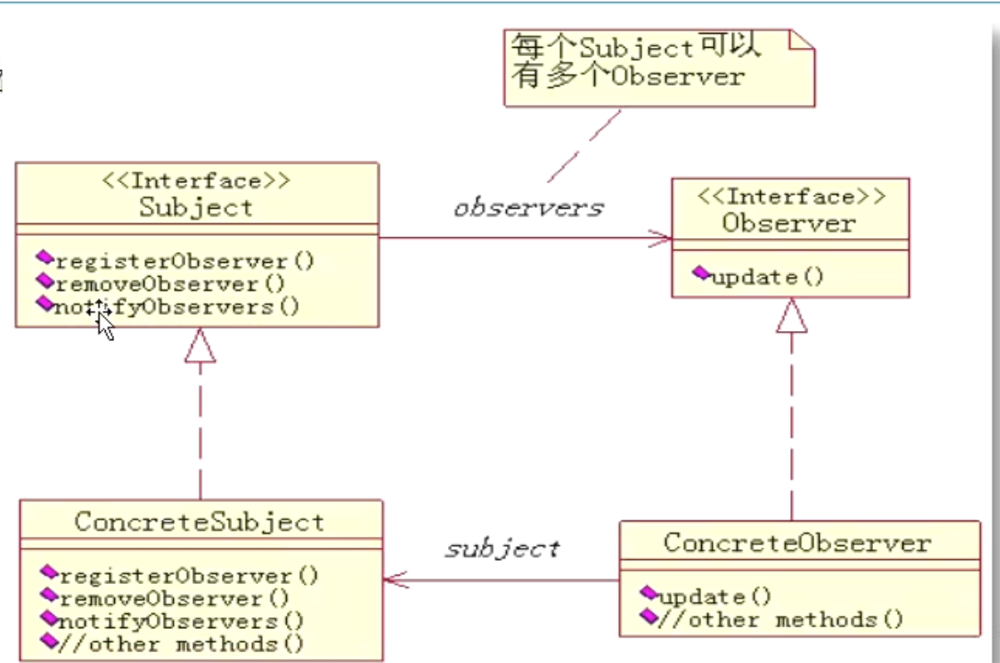

## 设计模式

[TOC]

### 单例模式
保证一个类仅有一个实例，并提供一个访问它的全局访问点

1. 构造方法私有化
2. 声明一个本类对象
3. 给外部提供一个静态方法获取对象实例

两种实例方式：

1. 饿汉式
2. 懒汉式

在项目中为什么要使用单例，单例有什么好处？

1. 在设计一些工具类的时候（通常工具类只有功能方法，没有属性）
2. 工具类可能会被频繁调用

目的是为了节省重复创建对象所带来的内存消耗，从而来提高效率

能不能用构造方法+静态方法来替代单例

```java
public class Test()
{
    public static void main(String[] args)
    {
        SginleTon1 s1 = SingleTon1.getInstance();
        s1.print();
        SginleTon1 s11 = SingleTon1.getInstance();
        s11.print();
        
        System.out.println(s1==s11);  // true
        
        SginleTon2 s2 = SingleTon2.getInstance();
        s2.print();
        SginleTon2 s22 = SingleTon2.getInstance();
        s22.print();
        
		System.out.println(s2==s22);  // true
    }
}

// 饿汉式
class SingleTon1
{
    private SingleTon1(){}
    // 在类被加载后对象被创建，到程序结束后释放
    // 占用内存的时间长，提高效率
    private static SingleTon1 s = new SingleTon1();
    public static SingleTon1 getInstance()
    {
        return s;
    }
    public void print()
    {
        System.out.println("测试方法");
    }
}

// 懒汉式 v1：在多线程访问时会有安全问题
class SingleTon2()
{
    private SingleTon2(){}
    private static SingleTon2 s;

    // 在第一次调用 getInstance 方法时，对象被创建，到程序结束后释放
    // 占用内存的时间短，效率低（懒加载/延迟加载）
    public static SingleTon2 getInstance()
    {
        if (s == null) {
            s = new SingleTon2();
        }
        return s;
    }
    public void print()
    {
        System.out.println("测试方法");
    }
}

// 用构造方法+静态方法来实现工具类，比如 Math
// 在内存静态区一直存在
class Tools
{
    private Tools(){}
    public static void print1(){}
    public static void print2(){}
}
```

### 模板方法模式（抽象类应用）

模板方法模式（Template Method）：定义一个操作中的算法的骨架，而将一些可变部分的实例延迟到子类中。模板方法模式使得子类可以不改变一个算法的结构即可重新定义该算法的某些特定的步骤。

```java
public class Test{
    public static voicd main(String[] args)
    {
        UserManager um = new UserManager();
        um.action("admin", "add");  // 执行了添加操作
        um.action("guest", "add");  // 你没有操作权限，请联系管理员
    }
}

abstract class BaseManager
{
    public static void action(String name, String method) 
    {
        if ("admin".equals(name)) {
            execute(method);
        } else {
            System.out.println("你没有操作权限，请联系管理员");
        }
    }
    
    public abstract void execute(String method);
}

class UserManager extends BaseManager
{
    public void execute(String method)
    {
        // 用户是否登录的验证
        // 验证成功后才可以执行以下操作
        if ("add".equals(method)) {
            System.out.println("执行了添加操作");
        } else if ("del".equals(method)) {
            System.out.println("执行了删除操作");
        }
    }
}

class ClassManager extends BaseManager{
    // ...
}
```

### 策略模式（接口应用）

策略模式（Strategy Pattern），定义了一系列的算法，将每一种算法封装起来并可以相互替换使用，策略模式让算法独立于使用它的客户应用而独立变化。

OO 设计原则：

1. 面向接口编程（面向抽象编程）
2. 封装变化
3. 多用组合，少用继承

```java
public class Test
{
    public static void main(String[] args)
    {
        BaseService usr = new UserService();
        usr.setISave(new FileSave());
        usr.add("2222");
    }
}

// 把可变的行为抽象出来，定义一系列的算法
// 这样的好处是这些行为可以在真正时相互替换
interface ISave
{
    public void save(String data);
}

class FileSave implements ISave
{
    public void save(String data)
    {
        System.out.println("把数据保存到文件中。。。");
    }
}

class NetSave implements ISave
{
    public void save(String data)
    {
        System.out.println("把数据保存到网络上");
    }
}


abstract class BaseService
{
    private ISave isave;
    public void setISave(ISave isave)
    {
        this.isave = isave;
    }
    public void add(String data)
    {
        System.out.println("检查数据合法性");
        isave.save(data);
        System.out.println("数据保存完毕");
    }
}

class UserService extends BaseService
{
}
```

### 简单工厂模式

是由一个工厂对象决定创建出哪一种产品类的实例。简单工厂模式是工厂模式家庭中最简单实用的模式。

```java
public class Test
{
    public static void main(String[] args)
    {
        // 使用者和被使用者两者之间耦合，产生了依赖，当被使用者改变时，会影响到使用者
        Product phone = new Phone();
        phone.work();
        // 使用工厂模式来降低两者之间的依赖
        Product phone = ProductFactory.getProduct("phone");
    }
}

interface Product
{
    public void work();
}

class Phone implements Product
{
    public void work()
    {
        System.out.println("手机开始工作。。。");
    }
}

class Computer implements Product 
{
    public void work()
    {
        System.out.println("电脑开始工作。。。");
    }
}

// 工厂类
class ProductFactory
{
    public static Product getProduct(String name)
    {
        if ("phone".equals(name)) {
            return new Phone();
        } else if ("computer".equals(name)) {
            return new Computer();
        } else {
            return null;
        }
    }
}
```

### 静态代理模式

代理模式（Proxy）：为其它对象提供一种代理以控制对这个对象的访问。

代理模式说白了就是“真实对象”的代表，在访问对象时引入一定程度的间接性，因为这种间接性可以附加多种用途。

```java
public class Test
{
    public static void main(String[] args)
    {
        Action userAction = new UserAction();
        ActionProxy proxy = new ActionProxy(userAction);
        proxy.doAction();
    }
}

class ActionProxy implements Action
{
    private Action target;  // 被代理的对象
    
    public ActionProxy(Action target)
    {
        this.target = target;
    }
    
    // 执行操作
    public void doAction()
    {
        long startTime = System.out.currentTimeMillis();
        target.doAction();  // 执行真正的业务
        long endTime = System.out.currentTimeMillis();
        Sytem.out.println("共耗时：" + (endTime - startTime) + "ms");
    }
} 

interface Action
{
    public void doAction();
}

class UserAction implements Action
{
    public void doAction()
    {
        for (int i = 0; i < 100; i++) {
           System.out.println("用户开始工作了");
        }
    }
}
```

### 适配器模式

适配器模式（Adapter），将一个类的接口转换成客户希望的另外一个接口。适配器模式使得原本由于接口不兼容而不能一起工作的那些类可以一起工作。

OO 设计原则：

1. 面向接口编程（面向抽象编程）
2. 封装变化
3. 多用组合，少用继承
4. **对修改关闭，对扩展开放**

例 1：

```java
public class Test
{
    public static void main(String[] args) 
    {
        PowerA powerA = new PowerAImpl();
        work(powerA);
        
        PowerB powerB = new PowerBImpl();
        // work(powerB); 不行
        Adapter adapter = new Adapter(powerB);
        work(adapter);
    }
    
    public static void work(PowerA a)
    {
        System.out.println("正在连接。。。");
        a.insert();
        System.out.println("工作结束。。。");
    }
}

interface PowerA
{
    public void insert();
}

class PowerAImpl implements PowerA
{
    public void insert()
    {
        System.out.println("电源 A 开始工作");
    }
}

interface PowerB
{
    public void connect();
}

class PowerBImpl implements PowerB
{
    public void connect()
    {
        System.out.println("电源 B 开始工作");
    }
}

// 适配器
class Adapter implements PowerA
{
    private PowerB powerB;
    
    public Adapter(PowerB powerB)
    {
        this.powerB = powerB;
    }
    public void insert()
    {
        powerB.connect();
    }
}
```

例 2：

```java
interface Animal
{
    public void sing();
    public void cry();
    public void run();
    public void swim();
}

// 适配器类
abstract class AnimalBehaviour 
{
    public void sing(){}
    public void cry(){}
    public void run(){}
    public void swim(){}
}

class Dog implements AnimalBehaviour
{
    public void run()
    {
        System.out.println("我在跑。。。");
    }
}
```

### 观察者模式

### 观察者模式

原理：
观察者模式定义：简单地说，观察者模式定义了一个一对多的依赖关系，让一个或多个观察者对象监察一个主题对象。
这样一个主题对象在状态上的变化能够通知所有的依赖于此对象的那些观察者对象，使这些观察者对象能够自动更新。

依赖于抽象，而不依赖于具体的实现

实现：
四个角色
- Subject（被观察的对象接口）
    规定 ConcreteSubject 的统一接口；
    每个 Subject 可以有多个 Observer
- ConcreteSubject（具体被观察对象）
    维护对所有具体观察者的引用的列表；
    状态发生变化时会发送通知给所有注册的观察者
- Observer（观者者接口）
    规定 ConcreteObserver 的统一接口；
    定义了一个 update() 方法，
    在被观察对象状态改变时被调用
- ConcreteObserver（具体观察者）
    维护一个对 ConcreteSubject 的引用；
    特定状态与 ConcreteSubject 同步；
    实现 Observer 接口，通过 update() 方法接收 ConcreteSubject 的通知
    
    

作用：
观察者模式在被观察者和观察者之间建立一个抽象的耦合。被观察者角色所知道的只是一个具体观察者列表。
由于被观察者和观察者没有紧密地耦合在一起，因此它们可以属于不同的抽象化层次。如果被观察者和观察者都被扔到一起，那么这个对象必然跨越抽象化和具体化层次。
观察者模式支持广播通讯。被观察者会向所有的登记过的观察者发出通知。




```java
// 被观察者的接口
public interface MessageSubject {
    public void registerObserver(Observer o);

    public void removeObserver(Observer o);

    public void notifyObservers();
}

// 观察者接口
public interface Observer {
    public void update(String message);
}


// 具体的被观察者
import java.util.ArrayList;
import java.util.List;

public class Message implements MessageSubject{
    // 维护的观察者列表
    private List<Observer> list = new ArrayList<>();
    private String message;

    public void setMessage(String message) {
        this.message = message;
        notifyObservers();
    }

    @Override
    public void registerObserver(Observer o) {
        list.add(o);
    }

    @Override
    public void removeObserver(Observer o) {
        list.remove(o);
    }

    @Override
    public void notifyObservers() {
        for (int i = 0; i < list.size(); i++){
            Observer observer = list.get(i);
            observer.update(message);
        }
    }
}

// 具体的观察者
public class User implements Observer{
    private String name;
    public User(String name){
        this.name = name;
    }

    @Override
    public void update(String message) {
        System.out.println("["+ name + "]收到消息：" + message);
    }
}

public class TestObserver {
    public static void main(String[] args) {
        Message message = new Message();
        User user1 = new User("lily");
        User user2 = new User("tom");
        User user3 = new User("vince");
        message.registerObserver(user1);
        message.registerObserver(user2);
        message.registerObserver(user3);

        message.setMessage("我来了");

        message.removeObserver(user1);
        message.setMessage("哈哈哈");
    }
}
```
